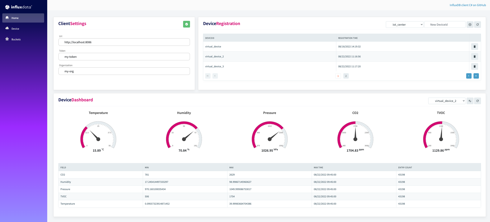
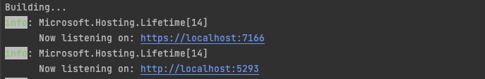

<div style="max-width: 1200px; min-width: 600px; font-size: 18px; margin: auto; padding: 50px;">


<h1>Example<a style="color: #d30971 !important;">Blazor.</a> Build on <a style="color: #d30971 !important;"> InfluxDB.</a></h1>



## Features

- bucket management - create, delete, clone
- write point to InfluxDB
- get data by query API from InfluxDB

## Getting Started

### Prerequisites

- dotnet - [Download .NET](https://dotnet.microsoft.com/en-us/download)
- Docker - [Get started with docker](https://www.docker.com/get-started)
- **InfluxDB** on port **8086** (influxdb 2.0 OSS)home
    - for start use docker-compose.yaml:
      ```bash
      docker-compose up
      ```

## Run Application

Launch app by typing the following commands in a terminal window:

```bash
cd ExampleBlazor
dotnet run
```

After a few seconds, you should get your application up and running. Take a look at your terminal window to get the
address your application is listening to.



### Home page

On Home page is InfluxDB client settings - credentials are preset to same values as in docker-compose.

### BucketAPI

This page contains basic methods from `GetBucketsApi()` in **influxdb-client-csharp**:

- `FindBucketsAsync` - for listing all buckets
- `CreateBucketAsync` - for creating new bucket
- `DeleteBucketAsync` - for deleting selected bucket
- `CloneBucketAsync` - for cloning selected bucket

### WriteAPI

On this page is use method from `GetWriteApi()` in **influxdb-client-csharp** for writing point to InfluxDB

- `WritePoint`.

### QueryAPI

This page contains multiple `select` for filtering data - after selecting Bucket, Measurement, Time range and clicking
on
`button` Refresh data `GetQueryApi()` in **influxdb-client-csharp** is used.

With selected data, flux query is created and `QueryAsync` is called.

```csharp
var fluxQuery = $"from(bucket: \"{SelectedBucket}\")"
              + $" |> range(start: -{_selectedTimeRange})"
              + $" |> filter(fn: (r) => (r[\"_measurement\"] == \"{_selectedMeasurement}\"))";

 _recordList = await influxDbClient.GetQueryApi().QueryAsync(fluxQuery, orgId);
```

<br clear="right"/>
</div>

