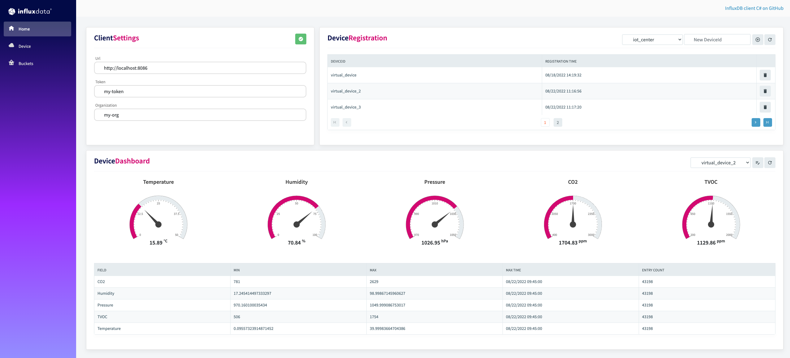
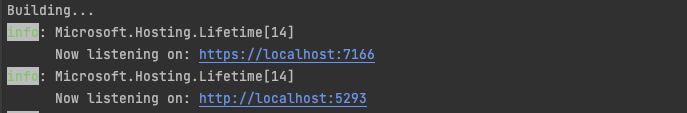
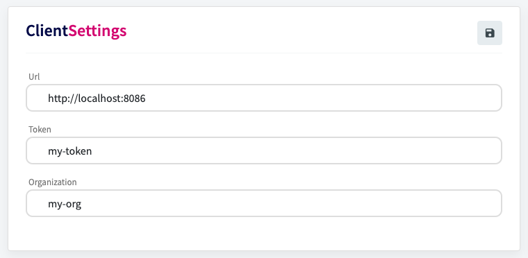
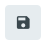
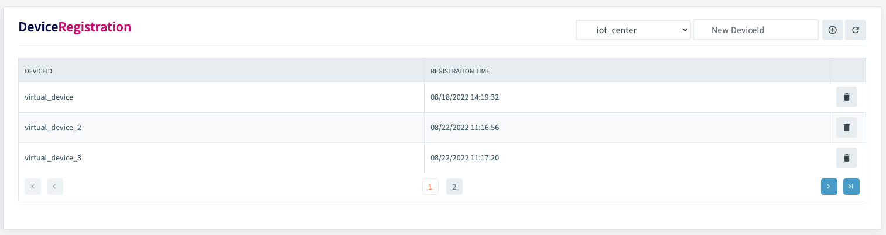
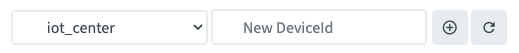
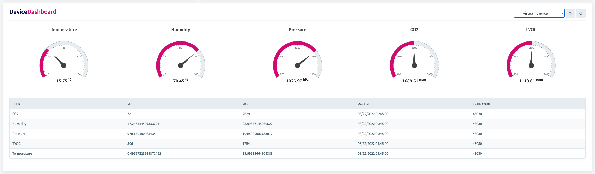
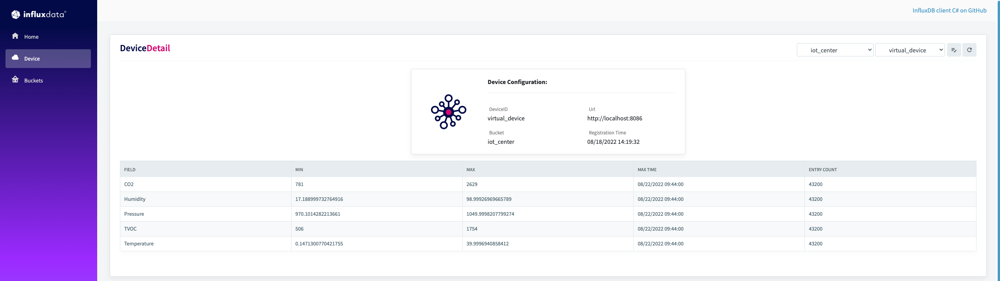
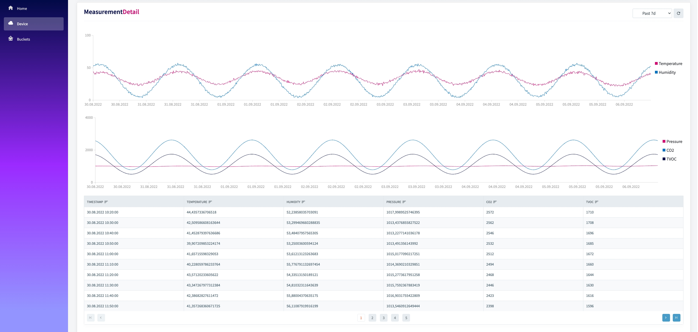
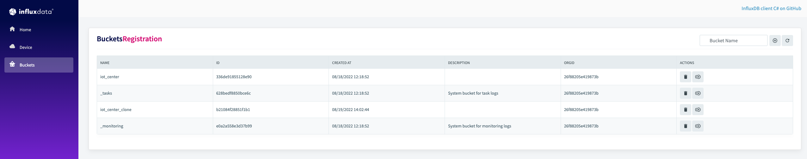

<div style="max-width: 1200px; min-width: 600px; font-size: 18px; margin: auto; padding: 50px;">


<h1>Example<a style="color: #d30971 !important;">Blazor.</a> Build on <a style="color: #d30971 !important;"> InfluxDB.</a></h1>



## Features

- bucket management - create, delete, clone
- device registration in InfluxDB
- remove device from InfluxDB
- write testing data to InfluxDB
- get data by query API from InfluxDB
- displaying device info and measurements
- data visualizations in gauge and simple chart

## Getting Started

### Prerequisites

- dotnet - [Download .NET](https://dotnet.microsoft.com/en-us/download)
- Docker - [Get started with docker](https://www.docker.com/get-started)
- **InfluxDB** on port **8086** (influxdb 2.0 OSS)home
    - for start use docker-compose.yaml:
      ```bash
      docker-compose up
      ```

## Run Application

Launch app by typing the following commands in a terminal window:

```bash
cd ExampleBlazor
dotnet run
```

After a few seconds, you should get your application up and running. Take a look at your terminal window to get the
address your application is listening to.



### Home page

#### Client Settings

On Home page is InfluxDB client settings - credentials are preset to same values as in docker-compose.
After editing credentials, changes must be saved by clicking on button in top right corner, connection to InfluxDB is 
checked then. There are three types of button state:

-  - connection to InfluxDB wasn't checked
-  - check connection to InfluxDB was successful, changes was saved
-  - check connection to InfluxDB wasn't successful

Connection to InfluxDB is checked by `PingAsync()` method:
```csharp
public static async Task<bool> CheckClient(Client? client)
{
    var influxDbClient = client?.GetClient();
    return await influxDbClient?.PingAsync()!;
}
```

#### Device Registration



Load active devices (`_value` field cannot be empty) to `RadzenDataGrid` from InfluxDB using `GetQueryApi` with following query -
[FetchDeviceList](/Data/InfluxModel#L148):
```csharp
var query = $"from(bucket: \"{bucket}\")" +
             " |> range(start: -30d)" +
             " |> filter(fn: (r) => r[\"_measurement\"] == \"deviceauth\"" + 
             "                  and r[\"_field\"] == \"key\")" +
             " |> last()" +
             " |> filter(fn: (r) => r[\"_value\"] != \"\")";
```

Each row contains `button` for deleting device. After deleting device **isn't** remove from InfluxDB - in this case **deleting** is meaning **removing of device
authorization** and **IoT Authorization**.

Removed device has in InfluxDB empty fields `key` and `token`, it means, that device authorization was removed via
`GetWriteApi`- [_removeDeviceAuthorization](/Data/InfluxModel#L313):
```csharp
 var point = PointData.Measurement("deviceauth")
                    .Tag("deviceId", deviceId)
                    .Field("key", "")
                    .Field("token", "");
using var writeApi = influxDbClient.GetWriteApi();
writeApi.WritePoint(point, bucket, orgId);
```

IoT Authorization is also removed, in this case `GetAuthorizationsApi` is used - [_deleteIoTAuthorization](/Data/InfluxModel#L339):
```csharp
var authorizationApi = influxDbClient.GetAuthorizationsApi();
await authorizationApi.DeleteAuthorizationAsync(key);
```

On right top corner are following elements:



- `select` with buckets list, default option `iot_center` is preselected, after changing option devices are reloaded 
for selected bucket
- `input` and `button` for adding new device
- `button` for refresh devices

For adding new device, to `input` enter device id, click to button for create. Device is automatically
registered in InfluxDB - it's write as point via `WriteService` with its authorization.

Example of creating device point in InfluxDB - [CreateDevice](/Data/InfluxModel#L199):
```csharp
var createdAt = DateTime.UtcNow.ToString("yyyy-MM-ddTHH\\:mm\\:ss.fffffffzzz", CultureInfo.InvariantCulture);
var point = PointData.Measurement("deviceauth")
            .Tag("deviceId", deviceId)
            .Tag("device", deviceType)
            .Field("createdAt", createdAt);

using var writeApi = influxDbClient.GetWriteApi();
writeApi.WritePoint(point, bucket, orgId);
await _createDeviceAuthorization(deviceId, bucket, orgId);
```

Creating device IoT authorization via `GetAuthorizationsApi` - [_createIoTAuthorization](/Data/InfluxModel#L248):
```csharp
var bucketId = await GetBucketId(bucket);
var influxDbClient = Client.GetClient();
var authorizationApi = influxDbClient.GetAuthorizationsApi();

var permissions = new List<Permission>
{
    new(
        Permission.ActionEnum.Read,
        new PermissionResource(
            "buckets",
            bucketId,
            orgID: orgId,
            org: Client.Org)),
    new(
        Permission.ActionEnum.Write,
        new PermissionResource(
            "buckets",
            bucketId,
            orgID: orgId,
            org: Client.Org))
};

var request = new AuthorizationPostRequest(
                orgId,
                description: "IoTCenterDevice: " + deviceId,
                permissions: permissions);
return await authorizationApi.CreateAuthorizationAsync(request);
```

#### Device Dashboard


On right top corner are following elements:

- `select` with devices, default option `virtual_device` is preselected (if exist in devices List), after changing option measurements are reloaded
  for selected device
- `button` for write emulated data to InfluxDB
- `button` for refresh

Emulated data are written to InfluxDB by `GetWriteApi` - [WriteEmulatedData](/Data/InfluxModel#L617):
```csharp
var writeApi = influxDbClient.GetWriteApi();

while (lastTime < toTime)
{
    lastTime += 60000; // emulate next minute

    var point = PointData.Measurement("environment")
        .Tag("clientId", deviceId)
        .Field("Temperature", _generateValue(30, 0, 40, lastTime))
        .Field("Humidity", _generateValue(60, 0, 99, lastTime))
        .Field("Pressure", _generateValue(20, 970, 1050, lastTime))
        .Field("CO2", Convert.ToInt32(_generateValue(1, 400, 3000, lastTime)))
        .Field("TVOC", Convert.ToInt32(_generateValue(1, 250, 2000, lastTime)))
        .Tag("TemperatureSensor", "virtual_TemperatureSensor")
        .Tag("HumiditySensor", "virtual_HumiditySensor")
        .Tag("PressureSensor", "virtual_PressureSensor")
        .Tag("CO2Sensor", "virtual_CO2Sensor")
        .Tag("TVOCSensor", "virtual_TVOCSensor")
        .Tag("GPSSensor", "virtual_GPSSensor")
        .Timestamp(Convert.ToInt64(lastTime), WritePrecision.Ms);

    writeApi.WritePoint(point, bucket, orgId);
}
```

Each `RadzenRadialGauge` contains data from InfluxDB using `GetWriteApi` - 
[FetchDataMean](/Data/InfluxModel#L419):

```csharp
var fluxQuery = $"from(bucket: \"{bucket}\")"
              + $" |> range(start: -{timeRange})"
              + $" |> filter(fn: (r) => (r[\"_measurement\"] == \"{measurement}\"))"
              + $" |> filter(fn: (r) => (r.clientId == \"{deviceId}\"))"
              + $" |> filter(fn: (r) => (r[\"_field\"] == \"{field}\"))"
              +  " |> mean()";

return (await influxDbClient.GetQueryApi().QueryAsync(fluxQuery, orgId)).FirstOrDefault();
```

Measurements in `RadzenDataGrid` are getting from InfluxDB using `GetQueryApi` -
[FetchMeasurements](/Data/InfluxModel#L461):

```csharp
var fluxQuery = $"deviceData = from(bucket: \"{bucket}\")"
                + "     |> range(start: -30d)"
                + "     |> filter(fn: (r) => (r[\"_measurement\"] == \"environment\"))"
                + $"    |> filter(fn: (r) => (r.clientId == \"{deviceId}\"))"
                + "measurements = deviceData"
                + "     |> keep(columns: [\"_field\", \"_value\", \"_time\"])"
                + "     |> group(columns: [\"_field\"])"
                + "counts = measurements |> count()"
                + "     |> keep(columns: [\"_field\", \"_value\"])"
                + "     |> rename(columns: {_value: \"count\"   })"
                + "maxValues = measurements |> max  ()"
                + "     |> toFloat()"
                + "     |> keep(columns: [\"_field\", \"_value\"])"
                + "     |> rename(columns: {_value: \"maxValue\"})"
                + "minValues = measurements |> min  ()"
                + "     |> toFloat()"
                + "     |> keep(columns: [\"_field\", \"_value\"])"
                + "     |> rename(columns: {_value: \"minValue\"})"
                + "maxTimes  = measurements |> max  (column: \"_time\")"
                + "     |> keep(columns: [\"_field\", \"_time\" ])"
                + "     |> rename(columns: {_time : \"maxTime\" })"
                + "j = (tables=<-, t) => join(tables: {tables, t}, on:[\"_field\"])"
                + "counts"
                + "|> j(t: maxValues)"
                + "|> j(t: minValues)"
                + "|> j(t: maxTimes)"
                + "|> yield(name: \"measurements\")";

return await influxDbClient.GetQueryApi().QueryAsync(fluxQuery, orgId);
```

### Device

#### Device Detail



On right top corner are following elements:

- `select` with buckets list, default option `iot_center` is preselected, after changing option devices are reloaded
  for selected bucket
- `select` with devices, default option `virtual_device` is preselected (if exist in devices List), after changing option measurements are reloaded
  for selected device
- `button` for write emulated data to InfluxDB, after write, data and measurements are reloaded
- `button` for refresh

Device Configuration `RadzenCard` contains basic device information. Registration time is getting from InfluxDB using 
`GetWriteApi` - [FetchDeviceCreatedAt](/Data/InfluxModel#L169):
```csharp
 var query = $"from(bucket: \"{bucket}\")" +
              " |> range(start: -30d)" +
              " |> filter(fn: (r) => r[\"_measurement\"] == \"deviceauth\"" +
              "                  and r[\"_field\"] == \"createdAt\"" +
             $"                  and r.deviceId == \"{deviceId}\")" +
              " |> keep(columns: [\"_field\", \"_value\"])" +
              " |> last()";
var result = await influxDbClient.GetQueryApi().QueryAsync(query, orgId);
```
Measurements in `RadzenDataGrid` are getting from InfluxDB using `GetQueryApi` -
[FetchMeasurements](/Data/InfluxModel#L461):

#### Measurements Detail



On right top corner are following elements:

- `select` with time range list, default option `Past 1d` is preselected, after changing, data are reloaded
- `button` for refresh

Data in `RadzenChart` and `RadzenDataGrid` are getting from InfluxDB using `Client.Linq` -
[FetchDataLinq](/Data/InfluxModel#L556):
```csharp
var query = from s in InfluxDBQueryable<MeasurementPoint>.Queryable(bucket, Client.Org, influxDbClient.GetQueryApiSync())
                where s.DeviceId == deviceId
                where s.Timestamp > timestamp
                where s.Timestamp.AggregateWindow(TimeSpan.FromSeconds(aggregate), null, "mean")
                orderby s.Timestamp
                select s;
return query.ToList();
```

### Buckets



On right top corner are following elements:

- `input` and `button` for adding new bucket
- `button` for refresh buckets

For adding new bucket, to `input` enter bucket name, click to button for create. Bucket is created in InfluxDB via 
`GetBucketsApi` with it's authorization via `GetAuthorizationsApi` - [CreateBucket](/Data/InfluxModel#L83):
```csharp
var retention = new BucketRetentionRules(BucketRetentionRules.TypeEnum.Expire, 3600);

var bucket = await influxDbClient.GetBucketsApi().CreateBucketAsync(name, retention, orgId);

var resource = new PermissionResource(PermissionResource.TypeBuckets, bucket.Id, null, orgId);
var read = new Permission(Permission.ActionEnum.Read, resource);
var write = new Permission(Permission.ActionEnum.Write, resource);

await influxDbClient.GetAuthorizationsApi().CreateAuthorizationAsync(orgId, new List<Permission> {read, write});
```

Load buckets to `RadzenDataGrid` from InfluxDB using `GetBucketsApi` - [FetchBuckets](/Data/InfluxModel#L137):
```csharp
 var bucketList = await influxDbClient.GetBucketsApi().FindBucketsAsync();
```

Each row contains `button` for deleting and clone bucket. Bucket is removed or cloned via `GetBucketsApi`- 
[DeleteBucket](/Data/InfluxModel#L57):
```csharp
await influxDbClient.GetBucketsApi().DeleteBucketAsync(bucket);
```
[CloneBucket](/Data/InfluxModel#L70):
```csharp
await influxDbClient.GetBucketsApi().CloneBucketAsync(name, bucket);
```
<br clear="right"/>
</div>